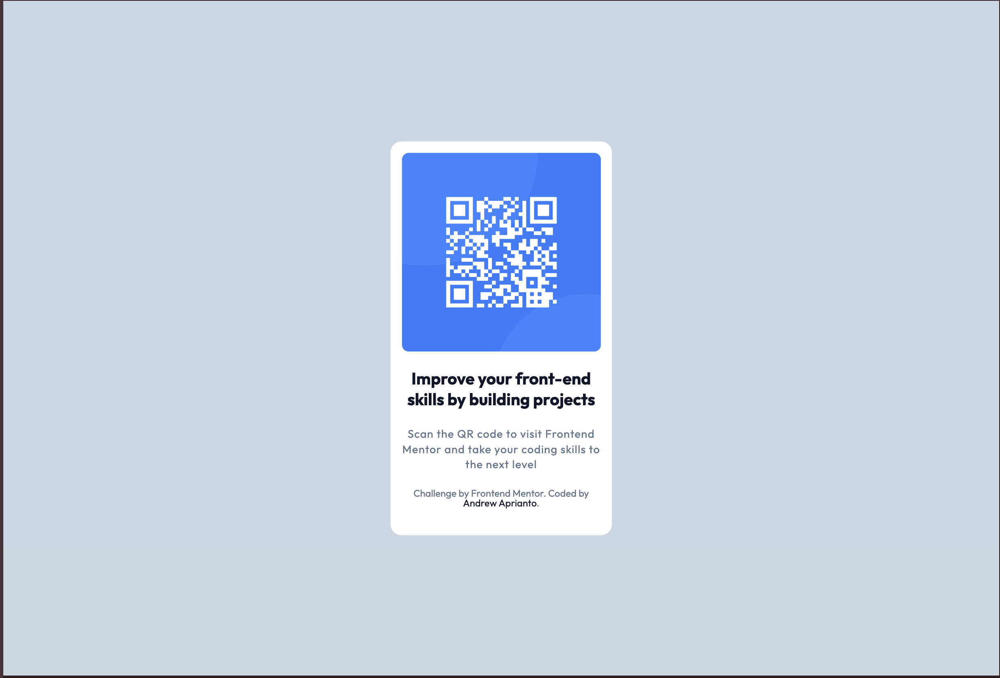

# Frontend Mentor - Revisited QR code component solution

This is a solution to the [QR code component challenge on Frontend Mentor](https://www.frontendmentor.io/challenges/qr-code-component-iux_sIO_H). Frontend Mentor challenges help you improve your coding skills by building realistic projects.

## Table of contents

- [Overview](#overview)
  - [Screenshot](#screenshot)
  - [Links](#links)
- [My process](#my-process)
  - [Built with](#built-with)
  - [What I learned](#what-i-learned)
  - [Continued development](#continued-development)
- [Author](#author)

**Note: Delete this note and update the table of contents based on what sections you keep.**

## Overview

### Screenshot

## Desktop

## Mobile

### Links

- Solution URL: [Github](https://github.com/meandrewaprianto/qr-code-componentsm)
- Live Site URL: [Vercel](https://qr-code-components-gold.vercel.app)

## My process

### Built with

- Semantic HTML5 markup
- Tailwind CSS
- Flexbox
- CSS Grid
- Mobile-first workflow

### Continued development

Sure, if anything new technologies, i will revisited it again.

## Author

- Frontend Mentor - [@meandrewaprianto](https://www.frontendmentor.io/profile/meandrewaprianto)
